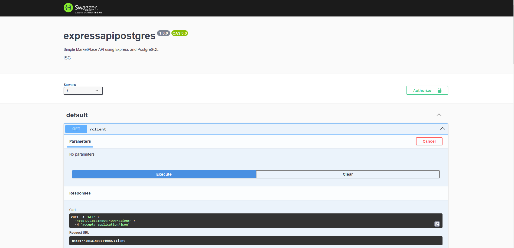

# ExpressAPIPostgres

## Description
Simple MarketPlace API using Express and PostgreSQL




## Prerequisites:
Before running this project, you must install the following:

- NodeJS: https://nodejs.org/en


- TypeScript: https://www.typescriptlang.org/download
    Command Used on this project to install TypeScript:
        - npm install typescript --save-dev

- PostgreSQL: To install, you can follow this guide: https://www.prisma.io/dataguide/postgresql/setting-up-a-local-postgresql-database


## Running the API:
If you just wish to run this API to make some tests, you can follow these steps:

1. Install all dependencies from the package.json:
```bash
npm install
```
2. Build the js files of the project and run the API:
```bash
npm run build-and-start
```

## Test of Post method
Use this command to test the post method of the /client route:
curl -X POST -H "Content-Type: application/json" -d '{
  "client_id": 123,
  "name": "First Client",
  "email": "first@client.com",
  "phone_number": "+123456789"
}' http://localhost:4000/client

Alternatively, you can now access the /docs route on your browser and test the post route with the Swagger UI

### Project Initial Configuration Generation
Before beginning the project, this command was used to generate an initial package.json configuration:
```bash
npm init --yes
```

### TypeScript Configuration
To begin working with TypeScript, this command was used:
```bash
npx tsc --init
```

These package and TypeScript execution engine are required for working with TypeScript:
```bash
npm install @types/node typescript
npm install -D ts-node
```

# Express modules Installation
Install the below modules to build api routes:
```bash
npm install express
npm install cors
```

### Types for above TypeScript modules
Install these types so that TypeScript can work with the modules above:
```bash
npm add @types/express
npm add @types/cors
```

## Generating OpenAPISpec and Routes
If you wish to regenerate the OAS and the routes.ts file, first you must have tsoa installed globaly with this command:
```bash
npm install -g tsoa
```
Then, to generate both the tsoa routes and the openapi spec on the build directory you can run:
```bash
npm run tsoa-prep
```